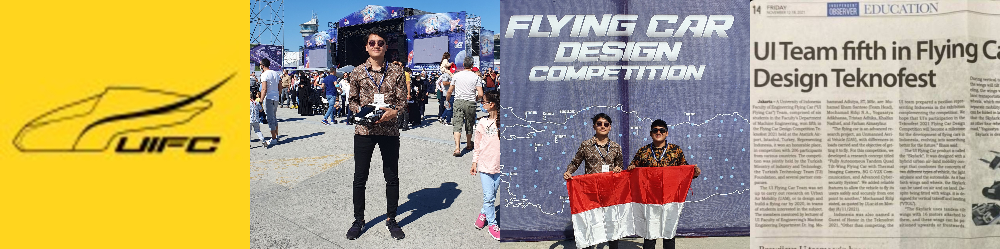
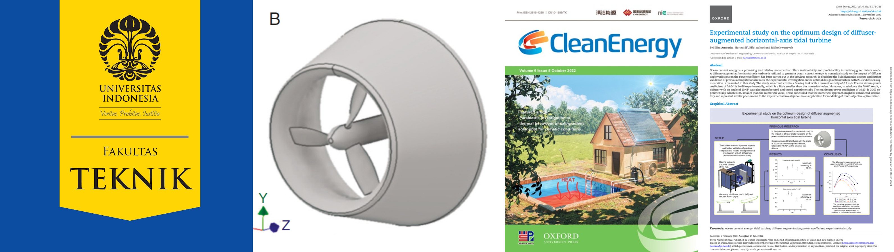
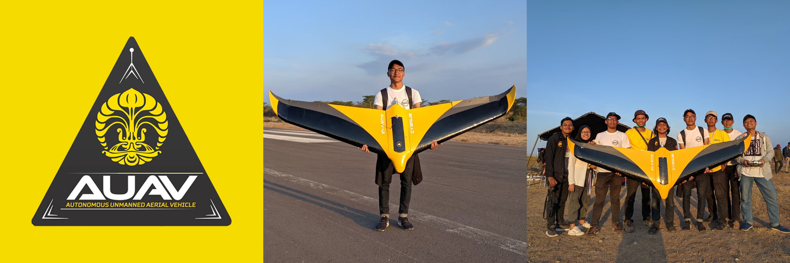

# Project Management Portfolio
---
## Flying Robotics

### SKYLARK

Electric Vehicle Urban Air Mobility (UAM) concept that could transport 2 people at its maximum capacity. The UAM consists of ground and fly parts. The UAM is designed to do VTOL and travel around 100 km. Funded by the university, got a finalist title (world number-14) in international competition.

---
### Predict Spaceship Titanic Passenger Who Got Transported (Classification) using Logistic Regression, Random Forest, KNN, Decision Trees, SVM, GradientBoosting Classifier, Catboost Classifier with Cross Validation (Top 7% in Kaggle - Solo)

In 2912, The Spaceship Titanic was an interstellar passenger liner launched a month ago. With almost 13,000 passengers on board, the vessel set out on its maiden voyage transporting emigrants from our solar system to three newly habitable exoplanets orbiting nearby stars. While rounding Alpha Centauri en route to its first destination—the torrid 55 Cancri E—the unwary Spaceship Titanic collided with a spacetime anomaly hidden within a dust cloud. Sadly, it met a similar fate as its namesake from 1000 years before. Though the ship stayed intact, almost half of the passengers were transported to an alternate dimension!

From this unique case, we have the objective to predict whether a passenger was transported to an alternate dimension during the Spaceship Titanic's collision with the spacetime anomaly. We use many classification algorithms for this binary classification case. From what I worked on, the results stated that the Catboost Classifier makes the best classifier algorithm with 0.80734 accuracy on the test set followed by Random Forest, SVM, Decision Trees, KNN, Logistic Regression.

---

---

---

---

© 2024. Powered by Jekyll and the Minimal Theme.

